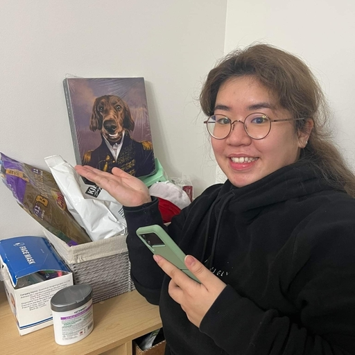

# Kalibrate

  

<h3 align="center">A free and open-source web application for managing and monitoring Kafka clusters.</h3>

 

## Table of Contents

- [About](##about)
- [Running Kalibrate in a Local Environment](##running-kalibrate-in-a-local-environment)
  - [Initialization](###initialization)
  - [Production](###production)
  - [Development](###development)
  - [Testing](###testing)
- [Running Kalibrate with Docker](##running-kalibrate-with-docker)
  - [Production](###production)
  - [Development](###development)
  - [Reset Docker Environment](###reset-docker-environment)
- [Environment Variables](##environment-variables)
- [Demo Kafka Cluster & Services](##demo-kafka-cluster-&-services)
  - [Running Demo Cluster](###running-demo-cluster)
  - [Running Demo Services](###running-demo-services)
  - [Reset the Cluster](###reset-the-cluster)
- [Contributing](##contributing)
- [Contrinutors](##contributors)
- [License](##license)

---

## About

[Insert description pulled from medium article]: What does your product do? What problem does it
solve? What are its most important features (i.e. what makes it stand out)? Include images.

Get started with Kalibrate by visiting our website [INSERT WEBSITE HYPERLINK], or check out our
launch article [INSERT MEDIUM ARTICLE HYPERLINK] to learn more about our intentions and design
philosophy. You can also follow Kalibrate on [INSERT SOCIALS].

[+ remember to update github about section with website link]

---

## Running Kalibrate in a Local Environment

### Initialization

Run `npm install` to install dependencies, followed by `npx prisma migrate dev --name init` to map
the Prisma Data Model to your database schema, and `prisma generate` to generate the Prisma Client.
Finally, the database can be initialized with necessary records by running
`node scripts/init-dv.js`.

### Production

Run `npm run build`, followed by `npm start`. By default, the server will listen on port 5173 and
the application will be accessible on `localhost:5173` in your browser.

### Development

Run `npm run dev`. An HMR enabled dev server will listen on port 5712 and the application will be
accessible on `localhost:5712` in your browser. Requests to the API will be proxied to the Express
server listenening on port 5173 by default.

### Testing

Run `npm run test` to run all tests. Unit and integration tests can be found in the `__tests__`
folder.

---

## Running Kalibrate with Docker

Before you begin, be sure to have Docker and Docker Compose installed.

### Production

Run `npm install` to install dependencies, followed by `npm run build` to output the production
bundles to the `dist` folder.

Run `npx prisma migrate dev --name init` to map the Prisma Data Model to your database schema,
followed by `prisma generate` to generate the Prisma Client and `node scripts/init-dv.js` to
initialize the database with necessary records.

Delete the `node_modules` folder, and build the Docker image for the production environment with
`npm run docker-build-prod`. You can verify that the `kalibrate-prod` image has been created by
running `docker images`.

Create the production container with `npm run docker-prod:run`. You can verify that the container
has been created by running `docker ps`.

By default, the Express server listens on port 5173 and the application can be viewed by navigating
to `localhost:5173` in your browser.

To stop the container, run `npm run docker-prod:stop`.

For deployment, check that the `dist` folder is not in your `.gitignore` file and that any changes
to your local repository have been committed. You can then zip the application with
`git archive -v -o kalibrate.zip --format=zip HEAD`.

### Development

Build the Docker images for the development environment and PostgreSQL database with
`npm run docker-build-dev`. This creates two images, `kalibrate-dev` and `kalibrate-postgres`, which
you can verify have been created by running `docker images`.

Run the Docker Compose container with `npm run docker-dev:up`. An HMR enabled dev server will listen
on port 5712 and the application will be accessible on `localhost:5712` in your browser. Requests to
the API will be proxied to the Express server listening on port 5173 by default. Environmental
variables have been preconfigured in the Docker Compose file to connect to the local PostgreSQL
database.

Stop the container with `npm run docker-dev:down`.

### Reset Docker Environment

You can remove all Docker images and containers with `npm run docker-remove-all`.

---

## Environment Variables

The following environment variables should be set in a root `.env` file:

- `PORT`: Port for the Express server
- `DB_URI`: PostgreSQL database URI, if you are not utilizing the Docker development container
- `SHADOW_DB_URI`: For certain hosted databases, Prisma may require you to provide a shadow database
  URI
- `SALT_WORK_FACTOR`: Salt work factor for bcrypt hashing
- `JWT_SECRET`: JSON Web Token secret
- `ENCRYPT_KEY`: Symmetric encryption key

---

## Demo Kafka Cluster & Services

Before you begin, be sure to have Docker and Docker Compose installed.

### Running Demo Cluster

The Kafka server is configured with 1 Zookeeper and 3 brokers. To create and spin it up, run
`npm run demo-kafka`.

### Running Demo Services

Once the Kafka server is running, spin up the services by running `npm run demo-services`.

These client instances create the following topics:

- Unfulfilled orders
- Inventory
- Payments
- FulFilled orders

They interract with the cluster in the following way:

- User service: produces to unfulfilled orders, subscribed to fulfilled orders
- Inventory Service: subscribed to unfulfilled orders, produces to inventory
- Payment Processing Service: subscribed to unfulfilled orders, produces to payments
- Shipping Service: subscribed to inventory & payments, produces to fulfilled orders
- Finance Service: subscribed to payments

### Reset the Cluster

Stop and remove the Kafka server by running `npm run demo-kafka-reset`.

---

## Contributing

Interested in contributing? We encourage you to fork the repository and open a pull request.

Planned features for future versions of Kalibrate include:

- Producing messages
- Adding more cluster metrics and visualization
- Adding more alerts
- Persisting more user preferences and enabled alerts
- Adding OAuth authentication
- Improving the UI
- Improving state management with Redux
- Improving caching with Redis
- Expanding testing

---

## Contributors

<table align="center">
  <tr>
    <td align="center">
      
       
      <b>Ashlee Gafaru</b>
       
      
      
    </td>
    <td align="center">
      
       
      <b>Jihui Xue</b>
       
      
      
    </td>
    <td align="center">
      
       
      <b>Jonah Hammond</b>
       
      
      
    </td>
     <td align="center">
      
       
      <b>Julien Devlin</b>
       
      
      
    </td>
    <td align="center">
      
       
      <b>Rebecca Kwong</b>
       
      
      
    </td>
  </tr>
</table>

---

## License

Kalibrate is MIT licensed.
